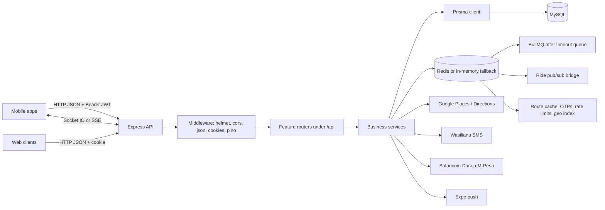
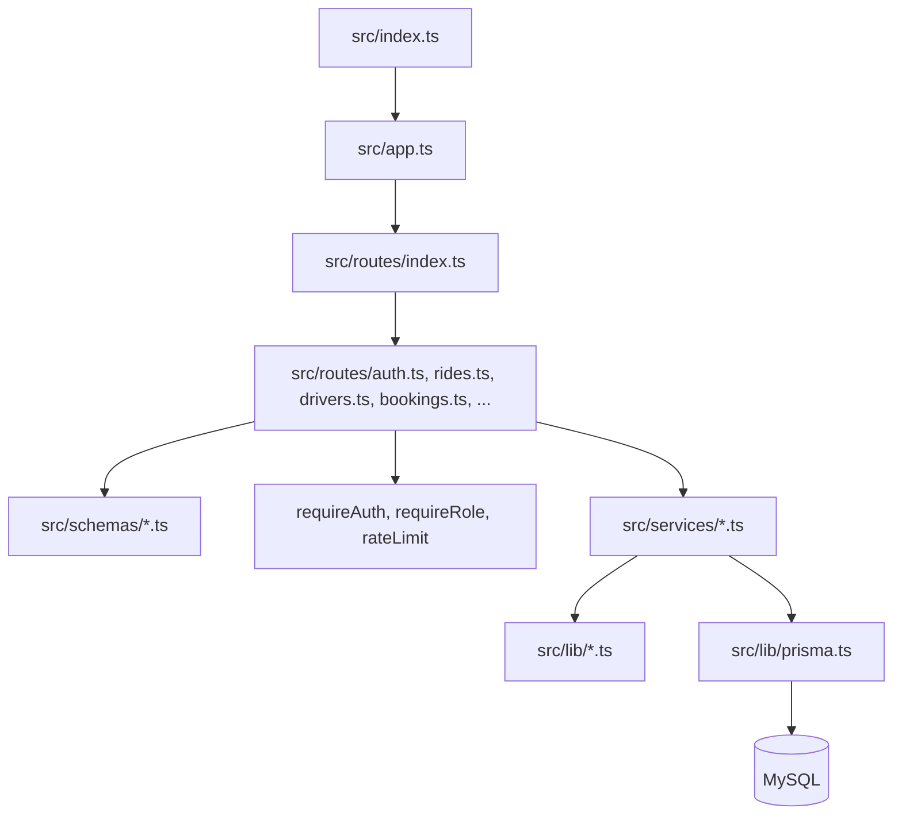
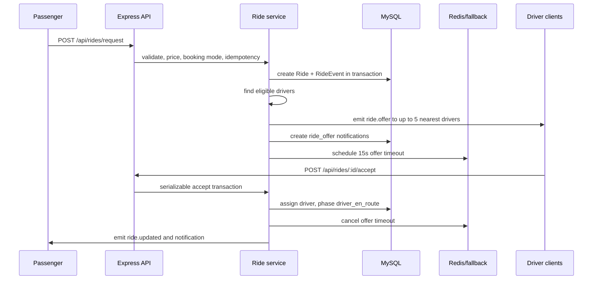
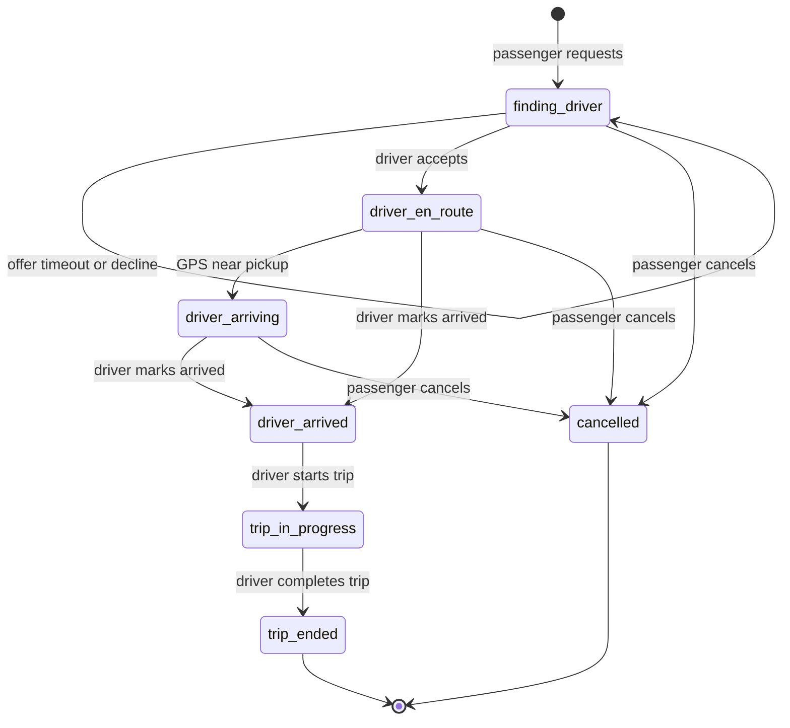
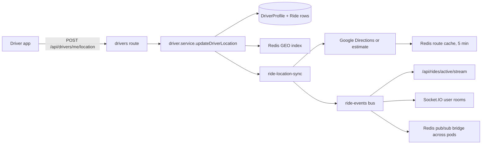
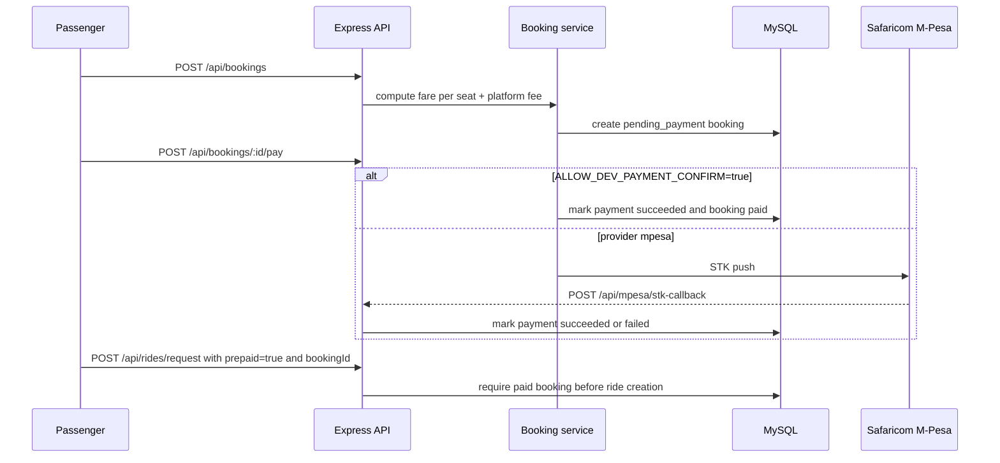
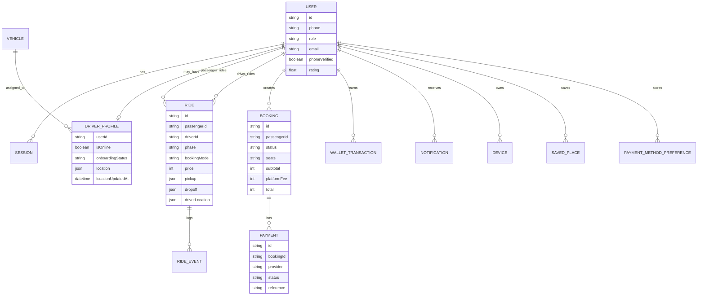

# Songa Backend Technical Documentation

This document explains the API routes, core algorithms, system architecture, and runtime flows for `songa-backend`.

## Runtime Shape

The service is an Express API mounted under `/api`, with Socket.IO mounted at `/socket.io`. Most routes use JSON over HTTP. Native clients authenticate with `Authorization: Bearer <sessionToken>`. Browser clients can also use the `songa_session` HttpOnly cookie that is set during login.



## Code Architecture

| Layer | Main files | Responsibility |
| --- | --- | --- |
| Boot | `src/index.ts` | Load env, assert Prisma client, start Express, attach Socket.IO, start ride event bridge, start BullMQ worker when Redis is configured |
| App shell | `src/app.ts` | Security middleware, CORS, JSON parsing, static uploads, HTTP logging, root `/api` router, errors |
| Routes | `src/routes/*.ts` | Auth/role checks, Zod request parsing, HTTP status codes, service calls |
| Services | `src/services/*.ts` | Business rules, Prisma transactions, payments, dispatch, wallet, profile logic |
| Shared libraries | `src/lib/*.ts` | JWTs, OTPs, Redis abstraction, ride events, pricing, routing, idempotency, errors, responses |
| Contracts | `src/schemas/*.ts` | Zod schemas and OpenAPI registration |
| Data model | `prisma/schema.prisma` | MySQL schema, enums, relations, indexes |
| Tests | `tests/*.test.ts` | Route and service behavior with Vitest/Supertest |



## Route Catalog

The interactive contract is served at `GET /api/docs`; raw OpenAPI JSON is served at `GET /api/openapi.json`.

### Health And Documentation

| Method | Path | Auth | Purpose |
| --- | --- | --- | --- |
| `GET` | `/api/health` | Public | Liveness check |
| `GET` | `/api/docs` | Public | Swagger UI |
| `GET` | `/api/openapi.json` | Public | OpenAPI JSON |

### Auth

| Method | Path | Auth | Purpose |
| --- | --- | --- | --- |
| `POST` | `/api/auth/register` | Public, rate-limited | Store pending registration and send OTP |
| `POST` | `/api/auth/register/confirm` | Public, rate-limited | Verify OTP, create user, issue session |
| `POST` | `/api/auth/login` | Public, rate-limited | Login by phone or email plus password |
| `POST` | `/api/auth/logout` | User | Revoke the current session and clear cookie |
| `GET` | `/api/auth/me` | User | Return the current user profile |

### Passenger Profile

All passenger routes require an authenticated passenger.

| Method | Path | Purpose |
| --- | --- | --- |
| `GET` | `/api/passengers/me` | Passenger profile |
| `PATCH` | `/api/passengers/me` | Update name/profile fields |
| `POST` | `/api/passengers/me/avatar` | Upload avatar from base64/data URL payload |
| `DELETE` | `/api/passengers/me/avatar` | Remove avatar |
| `GET` | `/api/passengers/me/saved-places` | List saved places |
| `POST` | `/api/passengers/me/saved-places` | Create saved place |
| `DELETE` | `/api/passengers/me/saved-places/:placeId` | Delete saved place |
| `GET` | `/api/passengers/me/payment-methods` | List preferred payment methods |
| `PUT` | `/api/passengers/me/payment-methods` | Replace preferred payment methods |
| `GET` | `/api/passengers/support` | Static support information |

### Places

All places routes require authentication. In dev, the service can use `data/dummy-places.json`; with Google keys it calls Google Places and Geocoding.

| Method | Path | Purpose |
| --- | --- | --- |
| `GET` | `/api/places/reverse?lat=&lng=` | Reverse GPS coordinates to a place |
| `POST` | `/api/places/autocomplete` | Place autocomplete |
| `GET` | `/api/places/:placeId?sessionToken=` | Resolve a selected place |

### Rides

Ride routes require authentication. Passenger-only and driver-only rules are enforced per endpoint.

| Method | Path | Role | Purpose |
| --- | --- | --- | --- |
| `POST` | `/api/rides/search` | Passenger | Search ride products, availability, ETA, fare, booking mode |
| `POST` | `/api/rides/request` | Passenger | Create a ride request; supports `Idempotency-Key` |
| `GET` | `/api/rides/active` | Passenger/driver | Current active ride snapshot |
| `GET` | `/api/rides/active/stream` | Passenger/driver | SSE stream of ride updates and driver offers |
| `GET` | `/api/rides/:rideId` | Passenger/driver on ride | Ride details |
| `GET` | `/api/rides/:rideId/navigation` | Passenger/driver on ride | Route, polyline, ETA, and Google Maps URL |
| `POST` | `/api/rides/:rideId/cancel` | Passenger | Cancel before trip start |
| `POST` | `/api/rides/:rideId/accept` | Driver | Accept offer; supports `Idempotency-Key` |
| `POST` | `/api/rides/:rideId/decline` | Driver | Decline offer |
| `POST` | `/api/rides/:rideId/arrived` | Driver | Mark driver arrived at pickup |
| `POST` | `/api/rides/:rideId/start` | Driver | Start trip |
| `POST` | `/api/rides/:rideId/complete` | Driver | Complete trip and credit wallet |
| `POST` | `/api/rides/:rideId/rate` | Passenger | Rate driver after trip ends |

### Drivers

Driver `me/*` routes require an authenticated approved driver. Nearby driver lookup requires authentication.

| Method | Path | Purpose |
| --- | --- | --- |
| `PATCH` | `/api/drivers/me/online` | Toggle driver online status; going online requires an activated vehicle |
| `POST` | `/api/drivers/me/location` | Persist GPS and sync any active ride ETA/location |
| `POST` | `/api/drivers/me/vehicle` | Register or update driver vehicle |
| `GET` | `/api/drivers/me/wallet` | Driver wallet balance and recent transactions |
| `POST` | `/api/drivers/me/wallet/cashout` | Request wallet cashout |
| `GET` | `/api/drivers/nearby?lat=&lng=&vehicleType=&radiusKm=` | Nearby online drivers |

### Bookings And Payments

Booking routes require an authenticated passenger.

| Method | Path | Purpose |
| --- | --- | --- |
| `POST` | `/api/bookings` | Create seat-selection booking |
| `POST` | `/api/bookings/:id/pay` | Start or simulate payment for a booking |
| `GET` | `/api/bookings/:id` | Booking and latest payment status |

### Notifications And Devices

| Method | Path | Auth | Purpose |
| --- | --- | --- | --- |
| `GET` | `/api/notifications?limit=` | User | Notification inbox |
| `POST` | `/api/devices` | User | Register Expo push token |

### M-Pesa Callbacks

These are public callback URLs intended for Safaricom.

| Method | Path | Purpose |
| --- | --- | --- |
| `POST` | `/api/mpesa/stk-callback` | STK payment result; marks bookings paid or payment failed |
| `POST` | `/api/mpesa/b2c-callback` | B2C payout result; posts or refunds cashout |
| `POST` | `/api/mpesa/b2c-timeout` | B2C timeout acknowledgement |

## Core Algorithms And Flows

### Authentication Flow

1. `POST /api/auth/register` normalizes the phone/email, validates password strength, stores pending registration in Redis/in-memory Redis, creates an OTP, hashes it with `OTP_PEPPER`, and sends SMS through the configured provider.
2. `POST /api/auth/register/confirm` consumes the OTP and pending registration, creates or updates the user, creates a driver profile when role is `driver`, records the OTP attempt, and creates a 30-day session.
3. `POST /api/auth/login` accepts phone or email plus role and password, verifies the password hash, creates a revocable session row, and returns a signed JWT.
4. `requireAuth` validates bearer token or cookie, verifies the token hash against the session row, rejects revoked/expired sessions, and attaches `req.user`.

### Ride Search And Pricing

`POST /api/rides/search` validates pickup/dropoff and rejects trips that are too short. Pricing is server-only:

```text
distanceKm = haversine(pickup, dropoff)
durationMinutes = estimated driving minutes
rawSubtotal = 100 base + round(distanceKm * 45) + durationMinutes * 5 + 25 booking fee
subtotal = max(rawSubtotal, 200 minimum fare)
priceAmount = round(subtotal * rideProduct.priceMultiplier)
```

Ride products are currently:

| Option | Vehicle type | Capacity | Multiplier |
| --- | --- | --- | --- |
| `car` | `Car` | 4 | `1.0` |
| `van` | `Van` | 7 | `1.3` |
| `minibus` | `Minibus` | 14 | `1.5` |

Booking mode is inferred from pickup/dropoff labels. Airport, SGR, terminal, or terminus patterns require `seat_selection`; other trips use `pay_on_arrival`.

### Ride Request And Dispatch



Driver eligibility for offers:

1. Driver profile is approved and online.
2. Driver has a vehicle and the vehicle type matches the requested ride product.
3. Last GPS update is fresh. Default freshness is 24 hours in local development, 120 seconds in production/test, or `DRIVER_LOCATION_FRESH_MS` when set.
4. Driver is not already assigned to an active ride.
5. Driver has not declined this ride.
6. Candidates are sorted by pickup distance. A preferred driver receives a single-driver offer; otherwise the nearest 5 get the offer.
7. If no driver accepts within 15 seconds, the timeout redispatches the ride while it is still `finding_driver`.

### Ride State Machine



Important rules:

- Passengers can cancel while `finding_driver`, `driver_accepted`, `driver_en_route`, or `driver_arriving`.
- Drivers can mark arrived from `driver_accepted`, `driver_en_route`, or `driver_arriving`.
- Drivers can start only from `driver_arrived`.
- Drivers can complete only from `trip_in_progress`.
- Completion creates a posted wallet credit for the full ride price.

### Live Location, ETA, And Realtime Updates



When a driver posts GPS:

1. The driver profile location and `locationUpdatedAt` are persisted.
2. If online, the driver is indexed in Redis GEO for nearby lookup.
3. If the driver has an active ride, the ride row receives `driverLocation`, `distanceKm`, `etaMinutes`, and possibly a phase transition to `driver_arriving`.
4. ETA uses Google Directions with traffic when `GOOGLE_MAPS_API_KEY` or `GOOGLE_PLACES_API_KEY` is set; otherwise it uses haversine distance plus urban speed estimates.
5. `ride.updated` emits immediately for phase changes and at most about once every 3 seconds for GPS-only updates.

### Booking And Payment Flow



Bookings use `seat_selection`; prepaid ride requests must include a paid `bookingId`. The backend blocks new ride requests while the passenger has another unpaid booking.

### Wallet And Cashout Flow

1. Completing a ride creates a posted `WalletTransaction` credit for the driver.
2. `GET /api/drivers/me/wallet` sums posted credits and posted/pending debits.
3. `POST /api/drivers/me/wallet/cashout` creates a pending debit.
4. If M-Pesa B2C is configured, the backend initiates payout and waits for `/api/mpesa/b2c-callback`.
5. Successful B2C marks the debit posted. Failed B2C marks it failed and creates a refund credit.

## Data Model Diagram



## Error Handling, Validation, And Safety

- Zod schemas validate request bodies and query strings at route boundaries.
- `AppError` provides stable error codes and HTTP statuses.
- `asyncHandler` forwards async errors to the global error middleware.
- Auth and places routes use rate limits backed by Redis or the in-memory fallback.
- Ride request and driver accept support idempotency via the `Idempotency-Key` header.
- Critical ride mutations use serializable Prisma transactions and conditional updates to prevent double-accept and invalid phase transitions.
- Redis dispatch locks prevent multiple timeout workers from redispatching the same ride at the same time.

## Deployment Notes

- Use a real Redis instance in production so OTPs, rate limits, route cache, pub/sub, Socket.IO scaling, and BullMQ timeouts work across pods.
- Configure `CORS_ALLOW_ALL=false` and set `CORS_ORIGINS` in production.
- Set long random values for `SESSION_JWT_SECRET` and `OTP_PEPPER`.
- Set `PUBLIC_API_URL` and the M-Pesa callback URLs when using Safaricom.
- Enable Google Directions for traffic-aware routing; without it the backend still works with deterministic estimates.
- Keep `ALLOW_DEV_PAYMENT_CONFIRM` disabled outside dev/demo environments.
