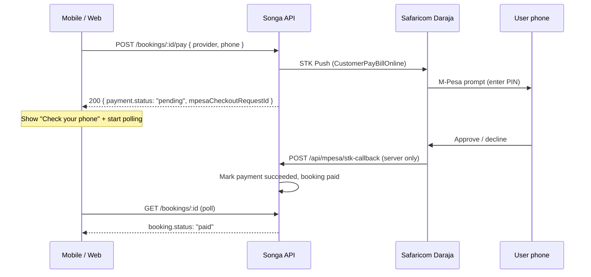

# M-Pesa — Frontend Integration Guide

Audit of the Songa backend M-Pesa flow for mobile/web clients. All paths are under the API prefix **`/api`**.

**Last audited:** 2026-06-20 against `src/services/mpesa.service.ts`, `src/routes/mpesa.ts`, `src/services/booking.service.ts`, and `src/services/wallet.service.ts`.

---

## Summary

| Flow | Who | How it works | FE action |
|------|-----|--------------|-----------|
| **Passenger booking pay (STK)** | Logged-in passenger | Backend sends Lipa na M-Pesa STK push; Safaricom callback marks booking paid | `POST /bookings/:id/pay` → poll `GET /bookings/:id` |
| **Guest pay invite (STK)** | Passenger without login (SMS link) | Same STK path, signed JWT token instead of session | `GET /shared-rides/pay-invites/:token` → `POST …/pay` → poll summary |
| **Driver cashout (B2C)** | Logged-in driver | Backend sends M-Pesa to driver's phone | `POST /drivers/me/wallet/cashout` → poll wallet |
| **Dev auto-pay** | Either | Skips Safaricom when env flag set | Same pay endpoints; booking paid immediately |

**Not available yet (backend returns 503):**

- Flutterwave / card checkout
- Manual Paybill or Till (`mpesaChannel: "paybill" | "till"`) — C2B reconciliation not implemented
- Real-time push to the app when STK completes — **poll booking or wallet**

---

## Architecture



Safaricom callbacks hit the backend only. The frontend **never** calls `/api/mpesa/*`.

---

## Environment behaviour

| Condition | Passenger pay result |
|-----------|---------------------|
| `ALLOW_DEV_PAYMENT_CONFIRM=true` | `POST …/pay` immediately marks booking **paid** (no STK, no phone required) |
| M-Pesa credentials missing + dev flag off | `503 MPESA_NOT_CONFIGURED` |
| M-Pesa configured + dev flag off | Real STK push; **`phone` required** |

Local default in `.env.example`: `ALLOW_DEV_PAYMENT_CONFIRM=true`.

Driver B2C cashout requires `MPESA_INITIATOR_NAME` + `MPESA_INITIATOR_PASSWORD` (+ certificate). Without B2C config, cashout still creates a **pending** debit but no automatic payout.

---

## Phone numbers

Send any common Kenyan format; backend normalizes to `254XXXXXXXXX`:

- `0712345678`
- `+254712345678`
- `254712345678`

Use the same field for STK push and driver cashout.

**Saved default:** `GET /api/passengers/me/profile` and `PUT /api/passengers/me/payment-methods` expose `paymentMethods[].mpesaPhone` when type is `mpesa`. Pre-fill the pay sheet from the default M-Pesa method or the user's account phone.

---

## 1. Passenger in-app booking payment (STK)

Used for:

- On-demand prepaid bookings (`POST /api/bookings` → pay → `POST /api/rides/request` with `prepaid: true`)
- Shared SGR bookings after `POST /api/shared-rides/departures/:id/bookings`

### Step 1 — Create booking

Already done by your product flow. Booking starts as:

```json
{ "status": "pending_payment", "total": 850, "currency": "KES", "payment": null }
```

`total` = `subtotal` + `platformFee` (platform fee is currently **50 KES**). STK amount is `Math.round(booking.total)`.

### Step 2 — Start payment

```http
POST /api/bookings/{bookingId}/pay
Authorization: Bearer {passengerToken}
Content-Type: application/json

{
  "provider": "mpesa",
  "phone": "+254712345678",
  "mpesaChannel": "stk"
}
```

| Field | Required | Notes |
|-------|----------|-------|
| `provider` | No (default `"mpesa"`) | Only `"mpesa"` works today |
| `phone` | Yes in production STK | Optional when `ALLOW_DEV_PAYMENT_CONFIRM=true` |
| `mpesaChannel` | No (default `"stk"`) | `"paybill"` / `"till"` → **503** `MPESA_MANUAL_DISABLED` |

**Success (STK initiated):**

```json
{
  "payment": {
    "id": "pay_…",
    "bookingId": "BKG-…",
    "provider": "mpesa",
    "status": "pending",
    "checkoutUrl": null,
    "reference": "ABC123…",
    "mpesaCheckoutRequestId": "ws_CO_…",
    "transactionRef": null,
    "createdAt": "2026-06-20T10:00:00.000Z"
  },
  "message": "Check your phone for the M-Pesa prompt and enter your PIN."
}
```

**Success (dev auto-pay):**

```json
{
  "payment": { "status": "succeeded", "transactionRef": "DEV-…", … },
  "message": "Payment confirmed (development mode)."
}
```

### Step 3 — Poll until terminal state

There is no websocket/SSE for payment completion. Poll:

```http
GET /api/bookings/{bookingId}
Authorization: Bearer {passengerToken}
```

| `booking.status` | `payment.status` | UI |
|------------------|------------------|-----|
| `pending_payment` | `pending` | Waiting for PIN / Safaricom |
| `paid` | `succeeded` | Success — show `payment.transactionRef` (M-Pesa receipt) |
| `pending_payment` | `failed` | STK declined or timed out — allow retry via another `POST …/pay` |
| `failed` | — | Booking failed (rare) |

**Suggested polling:** every 2–3s for up to ~90s after STK init, then offer retry.

On success, backend also sets `user.phoneVerified = true` for the passenger.

### Step 4 — Use paid booking (on-demand prepaid)

```http
POST /api/rides/request
{ "prepaid": true, "bookingId": "BKG-…", … }
```

If booking is not paid: `409 BOOKING_NOT_PAID`.

### Retry rules

- Calling `POST …/pay` again on a `pending_payment` booking **reuses** the pending payment row and clears the previous `mpesaCheckoutRequestId`.
- Only one active STK session per booking; avoid double-tapping pay.

---

## 2. Guest pay invite (no login)

For shared-ride **call-in** passengers who receive an SMS pay link. Token is a short-lived JWT (`typ: "booking_pay"`).

### Deep link / web URL

Backend builds links via `payInviteLink()`:

- App: `songa://shared-rides/pay-invite?token={jwt}`
- Web (if `PAY_INVITE_BASE_URL` set): `{PAY_INVITE_BASE_URL}/shared-rides/pay?token={jwt}`

### Step 1 — Load summary (no auth)

```http
GET /api/shared-rides/pay-invites/{token}
```

```json
{
  "booking": {
    "id": "BKG-…",
    "status": "pending_payment",
    "total": 750,
    "currency": "KES",
    "seats": [3],
    "routeLabel": "Nyali → SGR Mombasa",
    "passenger": { "phone": "+2547…", "name": "Jane" },
    "requiresLogin": false
  }
}
```

Token errors: `401 PAY_INVITE_INVALID` ("invalid or expired").

### Step 2 — Pay (no auth)

```http
POST /api/shared-rides/pay-invites/{token}/pay
Content-Type: application/json

{ "provider": "mpesa", "phone": "+254712345678" }
```

Response shape is **identical** to `POST /api/bookings/:id/pay` (`payment` + `message`).

### Step 3 — Poll

Re-call `GET /api/shared-rides/pay-invites/{token}` until `booking.status === "paid"`.

Same STK callback path as logged-in flow; seat holds move to `paid` on shared departures.

### Driver-side: regenerate invite

```http
POST /api/shared-rides/departures/{departureId}/seats/{seatNumber}/pay-invite
Authorization: Bearer {driverToken}
```

Returns `payInviteUrl`, `payInviteToken`, `reservedUntil`, `passengerPhone`.

---

## 3. Driver wallet cashout (M-Pesa B2C)

Drivers withdraw **collected** balance (shared SGR credits, prepaid ride credits). Cash pay-on-drop rides do **not** add withdrawable balance.

### Get wallet

```http
GET /api/drivers/me/wallet
Authorization: Bearer {driverToken}
```

```json
{
  "balance": 1200,
  "availableBalance": 1200,
  "pendingPayout": 0,
  "subscriptionDue": 150,
  "maxCashoutAmount": 1050,
  "currency": "KES",
  "transactions": [
    {
      "id": "tx_…",
      "label": "Shared van · Nyali → SGR",
      "amount": 700,
      "time": "2026-06-20T09:00:00.000Z",
      "type": "shared_booking_credit",
      "status": "posted",
      "currency": "KES"
    }
  ]
}
```

- **`subscriptionDue`:** daily fee (default **150 KES**, Nairobi calendar day). First cashout of the day auto-deducts it.
- **`maxCashoutAmount`:** `balance - subscriptionDue` when subscription not yet paid today.
- **`pendingPayout`:** sum of pending cashout debits.

### Request cashout

```http
POST /api/drivers/me/wallet/cashout
Authorization: Bearer {driverToken}
Content-Type: application/json

{
  "amount": 500,
  "method": "mpesa",
  "phone": "+254712345678"
}
```

**Success (B2C initiated):**

```json
{
  "transaction": {
    "id": "tx_…",
    "label": "Cashout · mpesa",
    "amount": -500,
    "type": "debit",
    "status": "pending",
    "currency": "KES",
    "time": "…"
  },
  "message": "Check your phone for the M-Pesa payout."
}
```

Poll `GET /api/drivers/me/wallet`:

| Cashout debit `status` | Meaning |
|------------------------|---------|
| `pending` | B2C in flight |
| `posted` | Money sent — payout complete |
| `failed` | Payout failed; funds returned to balance (no separate refund row) |

B2C completion is async via `/api/mpesa/b2c-callback` (server only).

---

## 4. Payment method preferences (passenger)

Not required for payment, but speeds checkout.

```http
GET /api/passengers/me/payment-methods
PUT /api/passengers/me/payment-methods
```

**Update body:**

```json
{
  "defaultType": "mpesa",
  "mpesaPhone": "+254712345678"
}
```

Types: `"cash" | "mpesa" | "card"`. Card is stored for future use; **card charging is not implemented**.

**Support screen** (includes display-only Paybill/Till hints for future manual pay):

```http
GET /api/passengers/support
```

```json
{
  "paymentHints": [ "…" ],
  "mpesa": {
    "businessName": "Songa",
    "paybill": "174379",
    "till": null
  }
}
```

Do **not** build a manual Paybill flow against these values — backend rejects `mpesaChannel: "paybill" | "till"`.

---

## 5. Error codes (M-Pesa related)

All errors: `{ "error": { "code", "message", "details?" } }`.

| HTTP | Code | When | FE handling |
|------|------|------|-------------|
| 400 | `PHONE_REQUIRED` | STK without `phone` (prod) | Prompt for M-Pesa number |
| 404 | `BOOKING_NOT_FOUND` | Wrong id or not owner | Navigate away |
| 409 | `INVALID_BOOKING_STATUS` | Pay when not `pending_payment` | Refresh booking |
| 409 | `BOOKING_NOT_PAID` | Prepaid ride before pay | Send to checkout |
| 409 | `INSUFFICIENT_FUNDS` | Driver cashout too large | Show `details.maxCashoutAmount` |
| 409 | `SUBSCRIPTION_DUE` | Cashout with balance below daily fee | Show `details.subscriptionDue` |
| 409 | `WALLET_BUSY` | Concurrent wallet op | Retry after short delay |
| 401 | `PAY_INVITE_INVALID` | Expired/invalid pay link | Show "link expired" |
| 502 | `MPESA_STK_FAILED` | Daraja rejected STK | Show `message`; allow retry |
| 502 | `CASHOUT_FAILED` | Daraja rejected B2C | Show `message`; balance restored |
| 503 | `MPESA_NOT_CONFIGURED` | Server missing M-Pesa keys | Block pay UI |
| 503 | `PAYMENT_PROVIDER_DISABLED` | `provider !== "mpesa"` | Force M-Pesa |
| 503 | `MPESA_MANUAL_DISABLED` | Paybill/Till selected | Hide manual pay options |

Validation errors (Zod): `400` with `code: "INVALID_INPUT"`.

---

## 6. UI checklist

### Passenger checkout

1. Show `booking.total` in KES before pay.
2. Collect / confirm M-Pesa phone (pre-fill from profile).
3. `POST /bookings/:id/pay` with `{ provider: "mpesa", phone }`.
4. On 200 + `payment.status === "pending"`: show Safaricom waiting state + **`message`**.
5. Poll `GET /bookings/:id` until `paid` or `payment.failed`.
6. On success: show `payment.transactionRef` as receipt reference.
7. On failure: explain user can retry pay (new STK).

### Guest pay webview / deep link

1. Parse `token` from URL.
2. `GET pay-invites/:token` → render route, seats, amount.
3. Same STK UX as above via `POST pay-invites/:token/pay`.
4. Poll the same GET until `paid`.

### Driver withdraw

1. Show `maxCashoutAmount`, not raw `balance`, when `subscriptionDue > 0`.
2. Validate amount ≤ `maxCashoutAmount` client-side.
3. After cashout POST, poll wallet until debit leaves `pending`.

### Do not implement

- Client calls to `/api/mpesa/stk-callback` or `/api/mpesa/b2c-callback`
- Paybill/Till "send money manually" flows (backend will not reconcile)
- Flutterwave / card checkout for bookings

---

## 7. Related flows (not STK)

| Flow | Endpoint | Notes |
|------|----------|-------|
| Driver marks seat paid cash | `POST /api/shared-rides/departures/:id/seats/:seatNumber/mark-paid-cash` | Marks booking paid without M-Pesa; passenger app should refresh departure seat map |
| On-demand pay-on-drop | No M-Pesa API | Passenger pays driver in cash at trip end; no booking pay step |
| Shared ride after pay | `GET /api/shared-rides/departures/:id` | Seat status becomes `paid`; driver gets wallet credit async |

---

## 8. OpenAPI

Interactive spec: **`GET /api/docs`** (Swagger UI).

Registered paths:

- `POST /api/bookings/{id}/pay`
- `GET /api/bookings/{id}`
- `POST /api/drivers/me/wallet/cashout`
- `GET /api/drivers/me/wallet`

Pay-invite routes are implemented but may not appear in OpenAPI yet — use this doc for those contracts.

---

## 9. Audit notes / known gaps

These are backend limitations the FE should plan around:

1. **No payment webhooks to clients** — polling only.
2. **Manual Paybill/Till disabled** — `mpesa-display` config is informational only.
3. **Single provider** — only M-Pesa STK for passenger collection.
4. **Guest pay token TTL** tied to seat hold expiry (call-in: 24h/72h rules in shared-rides docs).
5. **Driver B2C timeout callback** (`/api/mpesa/b2c-timeout`) is logged but does not auto-refund; rare edge case.
6. **Flutterwave** enum exists in schema but returns 503.

For shared SGR booking context (reserve → book → pay), see [SHARED_RIDES_MOBILE_INTEGRATION.md](./SHARED_RIDES_MOBILE_INTEGRATION.md).
