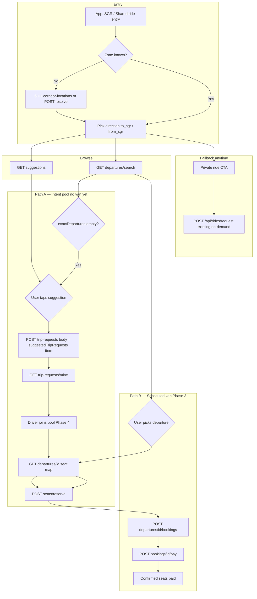
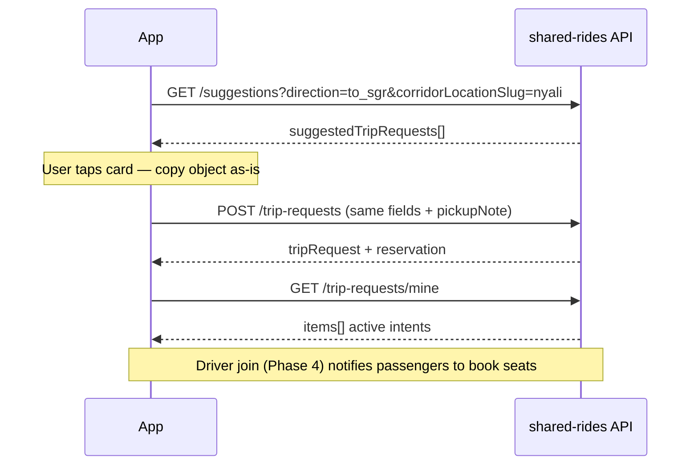
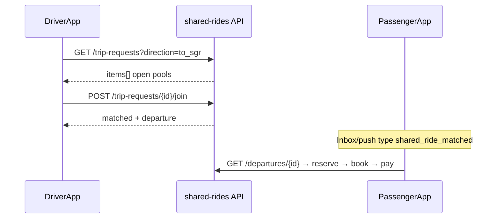
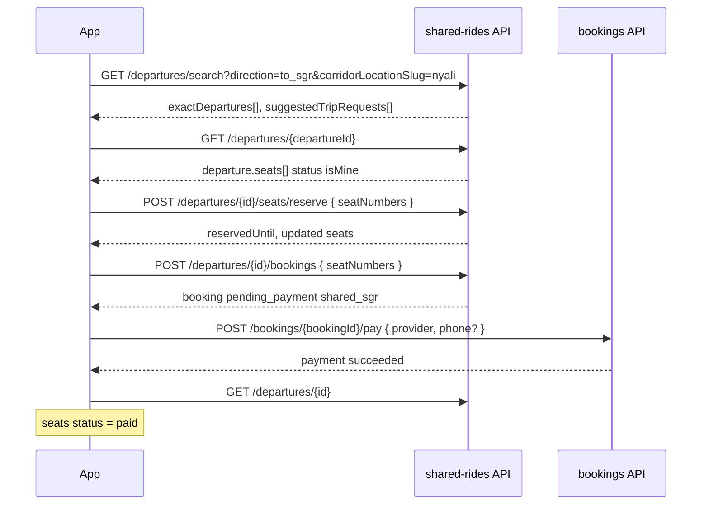
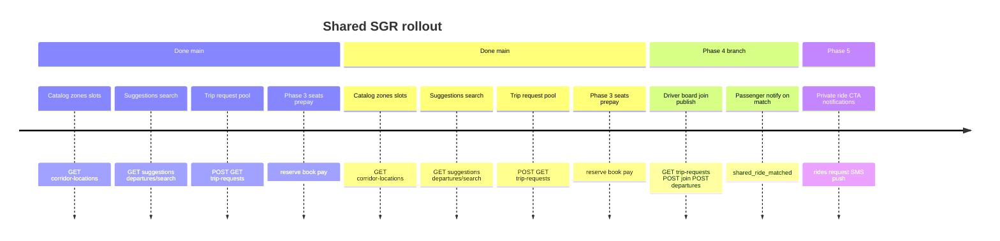

# Shared rides — mobile flow & route map

**Audience:** `songa-mobile-app` engineers integrating the coast **SGR Miritini** product.

**Related docs**

| Doc | Use for |
|-----|---------|
| [SHARED_RIDES_API.md](./SHARED_RIDES_API.md) | Request/response examples, error codes, env vars |
| [SHARED_RIDES_PHASE1.md](./SHARED_RIDES_PHASE1.md) | Engineering checklist (backend + mobile tasks) |
| [SHARED_RIDES_AUDIT.md](./SHARED_RIDES_AUDIT.md) | Product context vs on-demand `/api/rides/*` |
| **Live OpenAPI** | `{API_BASE}/api/docs` (tag **Shared rides**) · `{API_BASE}/api/openapi.json` |

**Base URL:** all routes below are under **`/api/shared-rides`** (plus **`/api/bookings`** for payment).

**Auth:** `Authorization: Bearer <sessionToken>` from `POST /api/auth/login` (`role: passenger` or `driver`). Same session as on-demand rides.

**Times:** Use **`vanDepartureAt` / `departureAt` / `requestedDepartureAt`** as ISO strings with **`+03:00`** (EAT). Copy values from API responses; do not recompute in the app unless you mirror Nairobi rules.

---

## Deployment status (what mobile can call today)

| Phase | Backend status | Mobile can integrate |
|-------|----------------|----------------------|
| **1 — Catalog** | On **`main`** | Yes |
| **2 — Trip request (intent)** | On **`main`** | Yes |
| **3 — Seats + prepay** | On **`main`** | Yes |
| **4 — Driver supply** | On **`feat/shared-rides-phase-4`** (merge before prod) | After merge |
| **5 — Polish** | Partial | Private ride → existing `/api/rides/*` today |

---

## Route reference (passenger)

### Live on `main` (Phases 1–2)

| Method | Path | Screen / purpose |
|--------|------|------------------|
| `GET` | `/api/shared-rides/corridor-locations` | Zone list (picker, settings) |
| `GET` | `/api/shared-rides/corridor-locations/{slug}` | Zone detail |
| `GET` | `/api/shared-rides/sgr-schedule-slots` | Full timetable (`?direction=&corridorLocationSlug=`) |
| `GET` | `/api/shared-rides/suggestions` | **Home / SGR entry** — 1–2 next bookable trains |
| `GET` | `/api/shared-rides/departures/search` | **Browse vans** — list + fallback suggestions |
| `POST` | `/api/shared-rides/trip-requests` | **One-tap intent** — “Request van for this slot” |
| `GET` | `/api/shared-rides/trip-requests/mine` | **My intents** — active pooled requests |

### After Phase 3 merge (or on PR branch locally)

| Method | Path | Screen / purpose |
|--------|------|------------------|
| `POST` | `/api/shared-rides/corridor-locations/resolve` | **GPS → zone** on map / “Use my location” |
| `GET` | `/api/shared-rides/departures/{departureId}` | **Seat map** — availability + `isMine` |
| `POST` | `/api/shared-rides/departures/{departureId}/seats/reserve` | Hold seats (15 min default) |
| `POST` | `/api/shared-rides/departures/{departureId}/seats/release` | Cancel hold (back navigation) |
| `POST` | `/api/shared-rides/departures/{departureId}/bookings` | Create `shared_sgr` booking |
| `POST` | `/api/bookings/{bookingId}/pay` | **Checkout** — M-Pesa / dev pay (existing screen) |

### Phase 4 — Driver (after branch merge)

| Method | Path | Screen / purpose |
|--------|------|------------------|
| `GET` | `/api/shared-rides/trip-requests` | **Driver board** — open pools |
| `POST` | `/api/shared-rides/trip-requests/{tripRequestId}/join` | Claim pool → publishes departure |
| `POST` | `/api/shared-rides/departures` | **Publish van** without a pool |

### Coming later (Phase 5)

| Method | Path | Screen / purpose |
|--------|------|------------------|
| — | `POST /api/rides/request` (existing) | **Private ride** CTA when no shared option fits |

---

## Corridor zones & direction

**Zones (slugs):** `mtwapa`, `nyali`, `bamburi`, `mombasa-cbd`, `diani`, `sgr-miritini`

| `direction` | Passenger story | Van runs |
|-------------|-----------------|----------|
| `to_sgr` | “Get me to the train” | Neighborhood → **SGR Miritini** (before train departs) |
| `from_sgr` | “Pick me up after the train” | **SGR Miritini** → neighborhood (after arrival) |

**Pricing:** Fixed **KES/seat** per zone + slot from timetable (`suggestedPricePerSeat` / `pricePerSeat`), not GPS distance.

---

## User flows (high level)

Two passenger paths share the same **zone + direction** setup; they diverge when the user either **joins a pool without a published van** or **books seats on a scheduled departure**.



---

## Path A — Trip request (intent) — **live on main**

Use when there is **no suitable `SharedDeparture`** yet, or product wants “request van for this train” without seat map.



**POST body** = one element from `suggestedTripRequests` (add `pickupNote`, `seatsRequested`).

**Pooling:** Same `sgrScheduleSlotId` + same `vanDepartureAt` → one `tripRequest.id`, multiple passengers.

---

## Path C — Driver claim — **Phase 4**



---

## Path B — Scheduled departure + seats — **Phase 3**

Use when **`departures/search`** returns a van (`exactDepartures` / `otherDepartures`).



**Rules for mobile**

1. **Reserve before book** — booking returns `409 SEATS_NOT_HELD` if hold expired or missing.
2. **Hold TTL** — default 15 minutes (`reservedUntil`); refresh UI countdown.
3. **One pending booking** — `409 UNPAID_BOOKING_PENDING` if another `pending_payment` exists.
4. **Payment** — reuse existing checkout (`/api/bookings/:id/pay`); booking `product` = `shared_sgr`.

**Demo departure id (dev seed):** `dep_seed_nyali_sgr_morning`

---

## Suggested screen map (mobile)

| Screen | APIs | Phase |
|--------|------|-------|
| SGR entry / replace `ride-share.tsx` mock | `suggestions`, `corridor-locations` | 1–2 |
| Zone picker | `corridor-locations`, `resolve` | 1 + 3 |
| Train slot list (optional deep link) | `sgr-schedule-slots` | 1 |
| Browse vans | `departures/search` | 1 |
| One-tap “Request van” card | `POST trip-requests` | 2 |
| My shared intents | `trip-requests/mine` | 2 |
| Departure detail + seat grid | `GET departures/:id`, reserve/release | 3 |
| Checkout | `POST departures/:id/bookings` → `POST bookings/:id/pay` | 3 |
| Driver board | `GET trip-requests`, `POST join` | 4 |
| Driver publish van | `POST departures` | 4 |

---

## What we are **not** changing (on-demand)

Keep using existing APIs for generic trips:

- `POST /api/rides/search` — distance fare  
- `POST /api/rides/request` — dispatch  
- Terminal / JKIA-style **seat_selection** via label rules in `trip-booking-rules.ts`  

Shared SGR is a **parallel product** under `/api/shared-rides/*`, not an extension of `Ride`.

---

## Error codes mobile should handle

| Code | Typical cause | UX hint |
|------|---------------|---------|
| `UNAUTHORIZED` | Missing/expired token | Re-login |
| `INVALID_INPUT` | Bad query/body | Show validation |
| `CORRIDOR_LOCATION_NOT_FOUND` | Bad slug | Refresh catalog |
| `SGR_SLOT_NOT_FOUND` | Stale slot id after re-seed | Re-fetch suggestions |
| `SLOT_NOT_BOOKABLE` | Too late for train | Pick next suggestion |
| `SEAT_NOT_AVAILABLE` | Taken or held | Refresh seat map |
| `SEATS_NOT_HELD` | Book without reserve / expired hold | Re-reserve |
| `UNPAID_BOOKING_PENDING` | Another open checkout | Resume or cancel |
| `DEPARTURE_NOT_FOUND` / `DEPARTURE_CLOSED` | Invalid or past van | Back to search |

Full list in [SHARED_RIDES_API.md](./SHARED_RIDES_API.md).

---

## Quick smoke (copy for QA)

```bash
export API=https://your-api.example.com/api
# Login → TOKEN, AUTH="Authorization: Bearer $TOKEN"

# Phase 1–2 (main)
curl -sS "$API/shared-rides/suggestions?direction=to_sgr&corridorLocationSlug=nyali" -H "$AUTH" | jq
curl -sS -X POST "$API/shared-rides/trip-requests" -H "$AUTH" -H 'Content-Type: application/json' -d @trip-body.json | jq

# Phase 3 (after merge)
curl -sS -X POST "$API/shared-rides/corridor-locations/resolve" -H "$AUTH" -H 'Content-Type: application/json' \
  -d '{"lat":-4.0207,"lng":39.7199}' | jq
curl -sS "$API/shared-rides/departures/dep_seed_nyali_sgr_morning" -H "$AUTH" | jq '.departure.seats | length'
```

---

## Roadmap diagram (backend + mobile)



---

## Changelog (doc)

| Date | Change |
|------|--------|
| 2026-06-01 | Initial mobile flow doc — routes, diagrams, main vs PR #3 |
